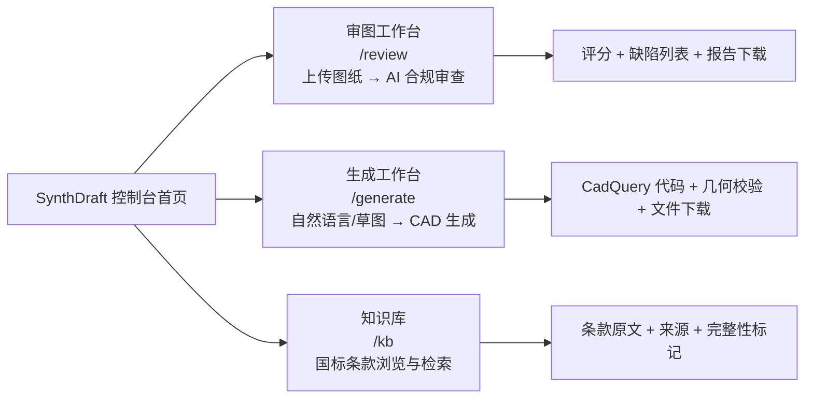
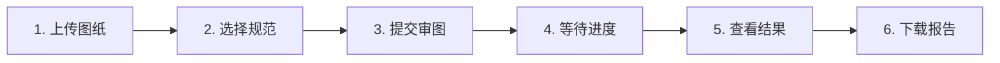
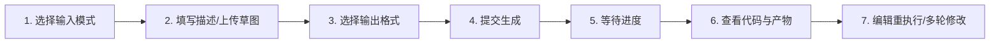
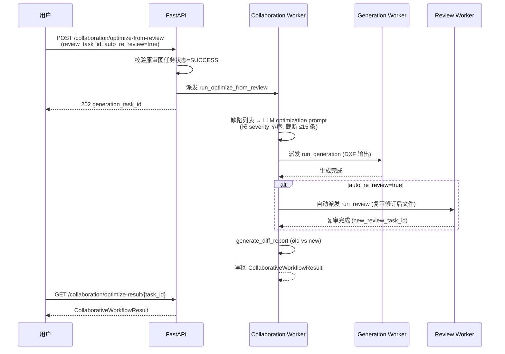

# AI 驱动工程设计辅助系统 — 用户使用手册

> 文档版本：v1.0
> 编写日期：2026-07-27
> 适用阶段：阶段三（P2）Task 18.4 用户使用手册
> 信息来源：实际代码与规格文件（见末尾"信息来源"），所有功能描述均基于实际实现的端点与前端页面

---

## 阅读须知

本手册基于 P1 阶段已通过 HARD GATE 验收的实际功能编写（来源：`P1_GATE_REPORT.md` §6.4 PASS）。为遵循"以实事求是为荣、以臆想业务为耻"原则，本手册对功能可用性作如下区分标注：

| 标注 | 含义 |
|---|---|
| **【Web UI】** | 前端页面已实现，可通过浏览器图形化操作 |
| **【API】** | 后端 API 端点已实现，需通过 HTTP 调用（暂无前端 UI 入口） |
| **【未暴露】** | 后端服务/Celery 任务已实现，但未提供 API 端点，用户暂不可触发 |

---

## 目录

- [1. 快速开始](#1-快速开始)
- [2. 智能审图模块](#2-智能审图模块)
- [3. 智能生成模块](#3-智能生成模块)
- [4. 工程规范知识库](#4-工程规范知识库)
- [5. 任务中心](#5-任务中心)
- [6. 常见问题（FAQ）](#6-常见问题faq)
- [7. 最佳实践](#7-最佳实践)

---

## 1. 快速开始

### 1.1 系统访问与首次配置

#### 1.1.1 访问 Web 控制台

系统提供基于 Next.js 14 的 Web 控制台，启动前端开发服务器后，在浏览器访问：

```
http://localhost:3000
```

控制台顶部显示"SynthDraft — AI 驱动工程设计辅助系统"标题栏，左侧导航栏提供三个工作台入口。右上角标注"开发模式"徽章（来源：`frontend/src/app/layout.tsx`）。

> **说明**：当前版本（P1）未实现登录页面与用户认证 UI，所有工作台直接可访问。后端虽已配置 JWT 鉴权能力（`JWT_SECRET_KEY` + `HS256`，来源：`backend/app/config.py`），但前端未接入登录流程。

#### 1.1.2 API Key 与模型配置

> **【说明】** 当前版本未提供"设置页面"供用户在 UI 中配置 API Key 与模型。所有 AI 模型与 API Key 通过后端环境变量配置（来源：`backend/app/config.py`）。

**默认配置（私有化部署，本地推理）**：

| 配置项 | 默认值 | 说明 |
|---|---|---|
| `LLM_PROVIDER` | `ollama` | LLM 提供方（ollama / openai / anthropic） |
| `LLM_MODEL` | `qwen2.5-coder:7b` | 本地 LLM 模型 |
| `VLM_MODEL` | `qwen2.5-vl:7b` | 本地视觉模型 |
| `EMBEDDING_MODEL` | `bge-m3` | 中英双语 Embedding 模型 |
| `OPENAI_API_KEY` | （空） | OpenAI 兼容 API 密钥（未配置则不调用） |
| `ANTHROPIC_API_KEY` | （空） | Anthropic Claude API 密钥（未配置则不调用） |

**切换为商业 API 增强模式**：在启动后端前设置环境变量，例如：

```bash
# 切换到 OpenAI（兼容 vLLM / DeepSeek / 通义千问 / 智谱 GLM）
export LLM_PROVIDER=openai
export OPENAI_API_KEY=sk-xxxx
export OPENAI_MODEL=gpt-4o-mini
export OPENAI_VLM_MODEL=gpt-4o

# 或切换到 Anthropic Claude
export LLM_PROVIDER=anthropic
export ANTHROPIC_API_KEY=sk-ant-xxxx
```

> **数据安全提示**：商业 API 模式下数据会出域。系统默认私有化部署（Ollama 本地推理），企业数据不出域。如需切换回纯本地模式，将 `LLM_PROVIDER` 设为 `ollama` 即可（来源：`spec.md` §"私有化部署与数据安全"）。

#### 1.1.3 后端服务依赖

Web 控制台通过 `/api/v1` 代理访问后端（默认 `http://localhost:8000`，可通过 `NEXT_PUBLIC_API_BASE_URL` 环境变量覆盖）。后端依赖以下服务（来源：`infra/docker-compose.yml`）：

| 服务 | 端口 | 用途 |
|---|---|---|
| FastAPI 后端 | 8000 | API 网关 |
| Redis | 6379 | Celery broker + result backend + 缓存 |
| PostgreSQL | 5433 | 结构化业务数据 |
| Qdrant | 6333/6334 | 规范条文向量检索 |
| MinIO | 9000/9001 | 图纸与生成产物对象存储 |
| Ollama | 11434 | 本地 LLM/VLM 推理 |

### 1.2 主界面导览

控制台首页（`/`）提供三大工作台卡片入口（来源：`frontend/src/app/page.tsx`）：



| 工作台 | 路径 | 核心能力 | 实现状态 |
|---|---|---|---|
| 审图工作台 | `/review` | 上传工程图，AI 自动审查合规性，输出评分与缺陷 | **【Web UI】** 完整可用 |
| 生成工作台 | `/generate` | 自然语言/草图生成 CadQuery 代码并执行，输出 CAD 文件 | **【Web UI】** 完整可用 |
| 知识库 | `/kb` | 浏览已索引国标规范，按关键词/条款检索 | **【Web UI】** 完整可用 |
| 任务中心 | — | 查询任意任务状态、取消任务 | **【API】** 仅 API，无前端页面 |

### 1.3 第一个审图任务（5 分钟教程）

> **【Web UI】** 以下操作均在审图工作台（`/review`）完成。

**前置条件**：后端服务运行中，且已上传一份工程图文件（DXF/DWG/PDF/PNG/JPG/SLDPRT/SLDASM）。

**操作步骤**：



1. **上传图纸**：在"上传图纸与选择规范"卡片中，点击虚线框或拖拽文件到框内。支持 DXF/DWG/PDF/PNG/JPG/SLDPRT/SLDASM，单文件 ≤ 100 MB。上传成功后显示文件名、类型徽章与 file_key。

2. **选择规范**：在"适用规范"区域勾选需应用的国家标准。系统预设 6 部 GB/T 规范，默认勾选前 2 项（GB/T 1182-2018 形位公差、GB/T 4457.4-2002 尺寸注法）。

3. **提交审图**：点击"提交审图"按钮。系统返回 202 Accepted 与 `task_id`，任务进入 Celery `reviews` 队列异步执行。

4. **等待进度**：页面显示"任务进度"卡片，通过 WebSocket（`/api/v1/ws/tasks/{task_id}`）每秒推送状态。状态流转：`queued → running → succeeded/failed`。

5. **查看结果**：任务完成后自动加载审图结果，展示：
   - 合规性评分（0-100）
   - 审图模式（VLM 视觉审图 / 向量审图 / 规则引擎）
   - 缺陷列表（可点击行展开查看证据、修改建议、坐标）
   - 应用规范列表

6. **下载报告**：点击"下载 HTML 报告"或"下载 PDF 报告"按钮，浏览器新窗口打开报告文件。

**预期耗时**：中等复杂度零件全流程 ≤ 5 分钟（来源：`spec.md` §"Scenario: 上传 SolidWorks 零件图进行审图"）。

> 完整示例见 [示例 1：DWG 工程图审图](#示例-1dwg-工程图审图完整流程)。

### 1.4 第一个生成任务（5 分钟教程）

> **【Web UI】** 以下操作均在生成工作台（`/generate`）完成。

**操作步骤**：



1. **选择输入模式**：在"输入与输出格式"卡片中，切换 Tab 选择"自然语言描述"或"草图上传"。

2. **填写描述**（自然语言模式）：在文本框输入零件描述，例如：
   ```
   生成一个直径 50mm、厚度 10mm 的法兰盘，中心孔直径 20mm，4 个均布螺栓孔
   ```
   或**上传草图**（草图模式）：拖拽 PNG/JPG 图片（≤ 20 MB）到上传区域。

3. **选择输出格式**：在"输出格式"区域选择 STEP / IGES / STL / DXF 之一（默认 STEP）。

4. **提交生成**：点击"生成"按钮。系统返回 202 Accepted 与 `task_id`，任务进入 Celery `generations` 队列。

5. **等待进度**：WebSocket 推送任务状态，同审图流程。

6. **查看结果**：任务完成后展示：
   - 生成模式（LLM 生成 / 模板生成）
   - 生成的 CadQuery Python 代码（CodePanel，可查看）
   - 沙箱执行结果（成功/失败、stdout/stderr、耗时、退出码）
   - 几何校验结果（体积、包围盒、表面积、是否自相交）
   - 可下载产物列表（STEP/STL/DXF 文件）

7. **编辑重执行**：点击代码面板的"编辑"按钮，修改 CadQuery 代码后点击"执行"，系统通过 `POST /api/v1/generations/execute` 同步执行并返回新产物。

8. **多轮修改**：在"修改指令"文本框输入修改要求（如"把直径改为 60mm，厚度增加到 12mm"），点击"发起新一轮生成"。系统将原 prompt 与修改指令拼接后发起新一轮生成。

> 完整示例见 [示例 2：自然语言生成法兰盘 STEP 文件](#示例-2自然语言生成法兰盘-step-文件完整流程)。

---

## 2. 智能审图模块

### 2.1 支持的输入格式

> **【Web UI】** 审图工作台支持以下格式（来源：`frontend/src/components/review/FileUploader.tsx` + `backend/app/api/v1/endpoints/uploads.py`）：

| 格式 | 扩展名 | file_type | 精度等级 | 说明 |
|---|---|---|---|---|
| SolidWorks 零件 | `.sldprt` | `sldprt` | 矢量级 | 需 SolidWorks Worker（Windows 节点） |
| SolidWorks 装配体 | `.sldasm` | `sldasm` | 矢量级 | 需 SolidWorks Worker（Windows 节点） |
| AutoCAD 工程图 | `.dwg` | `dwg` | 矢量级 | ODA File Converter 转 DXF 后解析 |
| DXF 工程图 | `.dxf` | `dxf` | 矢量级 | ezdxf 直接解析 |
| PDF 文档 | `.pdf` | `pdf` | 参考级 | 区域检测 + 区域受限 OCR |
| 图片 | `.png` `.jpg` `.jpeg` | `image` | 参考级 | 同 PDF 路径 |

**文件大小限制**：单文件 ≤ 100 MB（来源：`uploads.py` `_MAX_SIZE_BYTES`）。

**精度分级**（来源：`backend/app/schemas/review_detail.py` + `precision_classifier.py`）：
- `vector_level`（矢量级）：DXF/DWG/SLDPRT/SLDASM，几何数据精确
- `reference_level`（参考级）：PDF/图片，依赖 OCR 与 VLM，精度较低
- `sketch_level`（草图级）：手绘草图，需人工校准

> **最佳实践**：优先使用 DWG/DXF 格式，精度最高（详见 [7. 最佳实践](#7-最佳实践)）。

### 2.2 上传图纸与选择规范

> **【Web UI】**

**上传图纸**：
- 端点：`POST /api/v1/uploads`（multipart/form-data）
- 前端：审图工作台的 `FileUploader` 组件，支持拖拽与点击选择
- 返回：`file_key`（后续审图任务引用此 key）、`file_name`、`file_type`、`size`

**选择规范**：
- 系统预设 6 部 GB/T 规范（来源：`frontend/src/components/review/StandardsSelector.tsx`）：

| 规范编号 | 名称 |
|---|---|
| GB/T 1182-2018 | 形位公差 |
| GB/T 4457.4-2002 | 尺寸注法 |
| GB/T 17450-1998 | 技术制图图线 |
| GB/T 1804-2000 | 一般公差 |
| GB/T 131-2006 | 表面结构表示法 |
| GB/T 18229-2023 | CAD 工程制图规则 |

- 默认勾选前 2 项（与后端 `ReviewCreateRequest.standard_set` 默认值对齐）
- 可多选，至少选择 1 项

**提交审图任务**：
- 端点：`POST /api/v1/reviews`
- 请求体：
  ```json
  {
    "file_key": "a1b2c3d4..._零件图.dwg",
    "file_type": "dwg",
    "standard_set": ["GB/T 1182-2018", "GB/T 4457.4-2002"]
  }
  ```
- 返回：202 Accepted，含 `task_id` 与 `websocket_url`

### 2.3 审图进度查看（WebSocket 实时推送）

> **【Web UI】** 审图工作台自动通过 WebSocket 订阅任务进度。

**WebSocket 端点**：`/api/v1/ws/tasks/{task_id}`（来源：`backend/app/api/v1/endpoints/ws.py`）

**推送机制**：服务端每秒轮询 Celery `AsyncResult` 状态并推送 JSON 消息：

```json
{
  "task_id": "abc-123",
  "status": "running",
  "progress": 0
}
```

**状态映射**（Celery 原生状态 → 业务状态）：

| Celery 状态 | 业务状态 | 含义 |
|---|---|---|
| PENDING / RECEIVED | `queued` | 排队中 |
| STARTED / RETRY | `running` | 执行中 |
| SUCCESS | `succeeded` | 成功（消息含 `result` 字段） |
| FAILURE | `failed` | 失败（消息含 `error` 字段） |
| REVOKED | `canceled` | 已取消 |

任务进入终态（succeeded/failed/canceled）后，WebSocket 自动关闭连接。

### 2.4 审图结果解读

> **【Web UI】** 审图工作台在任务完成后展示完整结果。

#### 2.4.1 合规性评分（0-100）

- 字段：`compliance_score`，范围 0.0-100.0（来源：`backend/app/schemas/review_detail.py` `ReviewResult`）
- 评分由 `services/review/scoring.py` 基于缺陷数量与严重等级综合计算
- 前端以 `ScoreCard` 组件可视化展示评分与缺陷数量

#### 2.4.2 缺陷列表

每条缺陷（`DefectItem`）包含以下字段（来源：`backend/app/schemas/review_detail.py`）：

| 字段 | 类型 | 说明 |
|---|---|---|
| `category` | 枚举 | 缺陷类别（见下表） |
| `severity` | 枚举 | 严重等级：`critical`（严重）/ `major`（重要）/ `minor`（一般）/ `warning`（提示） |
| `coordinate` | `{x, y}` 或 null | 缺陷在图纸中的定位坐标（模型空间），无定位时为 null |
| `standard_ref` | string | 规范引用文本，如 `GB/T 4457.4-2002 §4.1` |
| `standard_clause_id` | string 或 null | 知识库中对应的条款 ID（如 `5.2`） |
| `suggestion` | string | 修改建议 |
| `evidence` | string | 缺陷证据描述（来自矢量数据或 VLM 视觉理解） |

**缺陷类别**（`category` 枚举）：

| 类别值 | 中文标签 |
|---|---|
| `title_block` | 标题栏 |
| `layer_naming` | 图层命名 |
| `dimensioning` | 尺寸标注 |
| `tolerance` | 形位公差 |
| `surface_roughness` | 表面粗糙度 |
| `line_type` | 线型 |
| `view_layout` | 视图布局 |
| `text_annotation` | 文字标注 |
| `other` | 其他 |

> **【Web UI】** 缺陷列表以表格展示（`DefectsTable` 组件），严重等级以彩色徽章区分（critical=红色、major=橙色、minor=黄色、warning=灰色）。点击任意行可展开查看完整证据、修改建议与坐标。

#### 2.4.3 图纸定位高亮

缺陷的 `coordinate` 字段提供模型空间坐标 `{x, y}`。当前版本在缺陷展开行中以文本形式显示坐标（如 `坐标: (120.5, 45.0)`）。报告文件（HTML/PDF）中含图纸渲染图片，便于人工定位。

#### 2.4.4 审图模式与精度等级

- `review_mode`：实际审图模式（`vlm` 视觉审图 / `vector_only` 向量审图 / `rule_engine` 规则引擎）
- `precision_level`：精度等级（`vector_level` / `reference_level` / `sketch_level`）
- `standards_applied`：实际应用的规范列表

### 2.5 审图报告导出（HTML/PDF）

> **【Web UI】** 审图结果卡片底部提供报告下载按钮。

**端点**：`GET /api/v1/reviews/{task_id}/report?format=html|pdf`（来源：`backend/app/api/v1/endpoints/reviews.py`）

**格式说明**：
- `format=html`：返回 HTML 报告（`text/html`），始终可用
- `format=pdf`：返回 PDF 报告（`application/pdf`）；若该任务未生成 PDF（`pdf_report_path` 为 null），自动回退到 HTML 并记录 warning

**前提条件**：任务状态必须为 `SUCCESS`，否则返回 404。

**前端行为**：
- "下载 HTML 报告"按钮：始终可用
- "下载 PDF 报告"按钮：仅当 `pdf_report_path` 存在时可用；不可用时显示"该任务暂无 PDF 报告"提示

### 2.6 用户反馈操作（误报标记/采纳/修改建议）

> **【API】** 当前版本前端审图工作台**未提供**反馈按钮（`DefectsTable` 组件仅展示缺陷，无反馈交互）。用户需通过 API 提交反馈。

**端点**：`POST /api/v1/collaboration/feedback`（来源：`backend/app/api/v1/endpoints/collaboration.py`）

**反馈动作**（`action` 字段，来源：`backend/app/schemas/collaboration.py` `FeedbackAction`）：

| 动作值 | 含义 | 说明 |
|---|---|---|
| `accept` | 采纳 | 用户认可该缺陷判定 |
| `reject_as_false_positive` | 误报 | 用户标记该缺陷为误报 |
| `modify_suggestion` | 修改建议 | 用户在 `comment` 中提供新建议 |

**请求示例**：

```bash
curl -X POST http://localhost:8000/api/v1/collaboration/feedback \
  -H "Content-Type: application/json" \
  -d '{
    "review_task_id": "abc-123",
    "defect_index": 0,
    "action": "reject_as_false_positive",
    "comment": "该尺寸标注实际符合 GB/T 4457.4 §4.2，非违规",
    "user_id": "engineer_001"
  }'
```

**反馈持久化**：反馈以 JSONL 文件存储（`OBS_FEEDBACK_STORE_PATH`，默认 `./tmp_metrics/feedback.jsonl`），后续可被 LLM 推理时检索，用于知识库迭代与提示词优化。

**查询反馈**：
- 查询某审图任务的所有反馈：`GET /api/v1/collaboration/feedback/{review_task_id}`
- 全局反馈统计：`GET /api/v1/collaboration/feedback-stats`

### 2.7 一键触发图纸优化（协同闭环）

> **【API】** 当前版本前端审图工作台**未提供**"优化图纸"按钮。用户需通过 API 触发协同闭环。

**端点**：`POST /api/v1/collaboration/optimize-from-review`（来源：`backend/app/api/v1/endpoints/collaboration.py`）

**流程**（来源：`spec.md` §"Scenario: 一键触发图纸优化" + `services/collaboration/`）：



**请求示例**：

```bash
curl -X POST http://localhost:8000/api/v1/collaboration/optimize-from-review \
  -H "Content-Type: application/json" \
  -d '{
    "review_task_id": "原审图任务ID",
    "output_format": "dxf",
    "auto_re_review": true
  }'
```

**查询优化结果**：`GET /api/v1/collaboration/optimize-result/{task_id}`

**修订前后对比报告**：`GET /api/v1/collaboration/diff-report/{old_review_task_id}/{new_review_task_id}`

对比报告（`DiffReport`）包含：
- 缺陷闭环状态：`resolved`（已修复）/ `unresolved`（未修复）/ `new`（新增）
- 闭环率：`closure_rate = resolved_count / old_defects_count`
- 评分提升：`score_improvement = new_score - old_score`

> 完整示例见 [示例 3：审图→生成→复审协同闭环](#示例-3审图生成复审协同闭环完整流程)。

---

## 3. 智能生成模块

### 3.1 自然语言生成 CAD

> **【Web UI】** 生成工作台的"自然语言描述"Tab。

#### 3.1.1 输入描述

在文本框输入零件的自然语言描述，支持中英文。描述越具体（包含几何参数、特征、尺寸），生成质量越高。

**输入示例**（中文）：
```
设计一个法兰盘，外径 100mm，内径 50mm，6 个均布孔直径 10mm，厚度 10mm
```

**输入示例**（英文）：
```
Generate a flange with outer diameter 100mm, inner diameter 50mm,
6 bolt holes of diameter 10mm evenly distributed, thickness 10mm
```

#### 3.1.2 生成参数选择（输出格式）

> **【Web UI】** 生成工作台的"输出格式"选择器。

支持以下输出格式（来源：`backend/app/schemas/generation.py` `GenerationCreateRequest`）：

| 格式 | 扩展名 | 说明 |
|---|---|---|
| STEP | `.step` / `.stp` | 默认，ISO 10303 标准中性格式，跨 CAD 平台通用 |
| IGES | `.iges` / `.igs` | 早期中性格式，兼容性好 |
| STL | `.stl` | 三角网格格式，主要用于 3D 打印 |
| DXF | `.dxf` | 2D 工程图格式，ezdxf 生成 |

> **说明**：SolidWorks 原生文件（SLDPRT）的生成需通过 SolidWorks Worker（Windows 节点 + SolidWorks 许可证）。当前 `/generations` 端点的 `output_format` 仅支持 step/iges/stl/dxf。SLDPRT 生成通过 SolidWorks Celery 任务实现（`generate_sldprt_from_cadquery` / `generate_sldprt_from_features`），历史已在 SolidWorks 2025 SP3.0 实测 70/70 PASS（来源：`P1_GATE_REPORT.md` 附录 B），但暂未通过 `/generations` 端点直接暴露给用户。

#### 3.1.3 代码查看与编辑（Monaco Editor）

> **【Web UI】** 生成结果展示 `CodePanel` 组件。

- **查看**：生成完成后，代码面板展示 LLM/模板生成的 CadQuery Python 代码（`generated_code` 字段）
- **编辑**：点击"编辑"按钮进入编辑模式，可直接修改代码
- **重新执行**：编辑后点击"执行"按钮，通过 `POST /api/v1/generations/execute` 同步执行
  - 请求体：`{ "code": "...", "output_format": "step", "timeout": 30 }`
  - 沙箱静态扫描黑名单：禁止 `os`/`subprocess`/`socket`/`ctypes`/`sys`/`shutil`/`pathlib`/`glob`/`importlib`/`pickle`/`marshal` 等（来源：`services/generation/sandbox.py`）
  - 返回：执行结果 + 几何校验 + 下载 URL

#### 3.1.4 重新执行

重新执行后，前端展示新的执行结果（stdout/stderr/耗时/退出码）、几何校验与下载链接，并标注来源为"重新执行"（区别于"初次生成"）。

### 3.2 多轮对话修改

> **【Web UI】** 生成结果底部的"修改指令"区域。

**操作方式**：在"修改指令"文本框输入修改要求，点击"发起新一轮生成"。

**实现机制**（来源：`frontend/src/app/generate/page.tsx` `handleModifySubmit`）：
- 系统将原 prompt 与修改指令拼接为新 prompt：`{原prompt}\n\n[修改指令] {修改指令}`
- 以 `input_type=text` 发起新一轮生成任务
- 原 prompt 历史保留在"Prompt 历史"列表中（仅展示，不会重新加载）

**示例**：
- 原 prompt：`生成一个直径 50mm、厚度 10mm 的法兰盘`
- 修改指令：`把直径改为 60mm，厚度增加到 12mm`
- 实际发送：`生成一个直径 50mm、厚度 10mm 的法兰盘\n\n[修改指令] 把直径改为 60mm，厚度增加到 12mm`

> **参数 diff 查看**：当前版本以"Prompt 历史"列表展示历次 prompt 文本，暂未提供结构化参数 diff 视图。增量更新通过新一轮生成实现（非局部参数调整）。

### 3.3 草图转 CAD

系统提供两条草图转 CAD 路径：

#### 3.3.1 路径 A：生成工作台的草图输入（基础路径）

> **【Web UI】** 生成工作台的"草图上传"Tab。

- 上传 PNG/JPG 草图（≤ 20 MB）
- 系统以 `input_type=sketch` 调用 `POST /api/v1/generations`
- 输出格式可选 step/iges/stl/dxf
- 生成结果同自然语言路径（CadQuery 代码 + 执行结果 + 下载）

#### 3.3.2 路径 B：专用草图端点（含人工校准，API-only）

> **【API】** 当前版本前端**未提供**专用草图校准 UI。用户需通过 API 调用。

**端点**（来源：`backend/app/api/v1/endpoints/sketch.py`）：
- 提交草图任务：`POST /api/v1/sketches`
- 查询草图结果：`GET /api/v1/sketches/{task_id}/result`
- 提交人工校准：`POST /api/v1/sketches/calibrate`
- 查询校准结果：`GET /api/v1/sketches/calibrate/{task_id}/result`
- 下载草图产物：`GET /api/v1/sketches/files/{file_path}`

**强制精度标注**：所有草图任务结果强制标注 `precision_level=sketch_level`（来源：`backend/app/schemas/sketch.py` + `spec.md` R7），提示用户必须人工校准尺寸。

**VLM 识别结果查看**：草图任务结果包含 `parse_result`（`SketchParseResult`）：
- `features`：识别到的几何特征列表（`feature_type`: line/circle/arc/rectangle/hole/chamfer/fillet/polygon/unknown）
- `overall_shape`：整体形状描述
- `dimensions_hint`：草图中标注的尺寸
- `warnings`：警告信息（如 VLM 不可用时降级提示）

**强制人工校准尺寸**：

校准项（`CalibrationItem`）字段：

| 字段 | 说明 |
|---|---|
| `feature_index` | 对应特征在 features 列表中的索引 |
| `feature_type` | 特征类型 |
| `parameter_name` | 参数名（如 radius/length/diameter） |
| `original_value` | VLM 推断值（可能不准确） |
| `calibrated_value` | 用户校准值 |
| `unit` | 单位（默认 mm，支持 inch→mm 自动转换） |

**校准请求示例**：

```bash
curl -X POST http://localhost:8000/api/v1/sketches/calibrate \
  -H "Content-Type: application/json" \
  -d '{
    "sketch_task_id": "原草图任务ID",
    "calibrations": [
      {
        "feature_index": 0,
        "feature_type": "circle",
        "parameter_name": "radius",
        "original_value": 45.0,
        "calibrated_value": 50.0,
        "unit": "mm"
      }
    ]
  }'
```

**前提条件**：原草图任务状态必须为 `SUCCESS`，否则返回 409 Conflict。

### 3.4 装配体生成

> **【未暴露】** 装配体生成服务与 Celery 任务已在 P1 阶段实现并通过 self_test（来源：`P1_GATE_REPORT.md` §2 + §3.1：`mate_library` 14 项、`standard_parts` 57 项、`validator` 13 项、`bom_exporter` 12 项检查全过），但**未提供 API 端点**（27 个 API 路径中不含装配体端点），用户当前无法通过 Web UI 或 API 触发装配体生成。

**已实现的后端能力**（来源：`backend/app/services/assembly/`）：
- `mate_library`：coincident/concentric/distance 三类配合关系
- `standard_parts`：6 类标准件工厂（bolt/bearing/shaft/flange_plate/key/gear）
- `validator`：interface/dof/connectivity/axioms 四维度验证
- `bom_exporter`：CSV/JSON/DXF(A3) 三种 BOM 导出格式
- Celery 任务：`app.celery.tasks.assembly.run_assembly_generation`（队列 `assembly`）

> 待后续阶段暴露 API 端点后，本节将补充用户操作流程。

### 3.5 生成后自动自检

> **【说明】** 普通生成任务（`POST /api/v1/generations`）**不会**自动触发审图自检。自动自检仅在协同闭环中通过 `auto_re_review=true` 参数触发（见 [2.7 一键触发图纸优化](#27-一键触发图纸优化协同闭环)）。

**生成任务的几何校验**（已实现）：生成结果含 `geometry_validation` 字段，对 STEP 文件进行几何校验：
- `is_valid`：是否通过校验（体积 > 0、包围盒在合理范围、无自相交）
- `volume`：体积（mm³）
- `bounding_box`：包围盒 (xmin, ymin, zmin, xmax, ymax, zmax)
- `surface_area`：表面积（mm²）
- `errors`：校验失败原因列表

> **【Web UI】** 生成工作台以 `GeometryValidationCard` 组件展示几何校验结果。

---

## 4. 工程规范知识库

### 4.1 浏览规范列表

> **【Web UI】** 知识库页面（`/kb`）顶部展示已索引规范列表。

**端点**：`GET /api/v1/kb/standards`（来源：`backend/app/api/v1/endpoints/kb.py`）

**返回**：当前 Qdrant collection 中已索引的规范编号列表（`standards` 数组 + `count`）。

**覆盖范围**（来源：`spec.md` §"工程规范知识库"）：
- P0：GB/T 1182、GB/T 4457.4、GB/T 17450、GB/T 1804、GB/T 131、GB/T 18229
- P1：GB/T 4458 系列、GB/T 14665、ISO 128、ISO 1101
- P2：JB/T 8836 等行业规范、企业自定义规范

### 4.2 按条款号/关键词/主题检索

> **【Web UI】** 知识库页面的搜索面板（`SearchPanel` 组件）。

**端点**：`GET /api/v1/kb/clauses`（来源：`backend/app/api/v1/endpoints/kb.py`）

**查询参数**：

| 参数 | 类型 | 必填 | 说明 |
|---|---|---|---|
| `query` | string | 是 | 查询文本（自然语言关键词或条款号） |
| `top_k` | int | 否 | 返回条数，默认 5，范围 1-50 |
| `standard` | string | 否 | 规范编号过滤，逗号分隔（如 `GB/T 1182-2018,GB/T 4457.4-2002`） |
| `category` | string | 否 | 分类过滤，逗号分隔 |

**检索方式**：混合检索（向量检索 Qdrant + 元数据过滤 LlamaIndex MetadataFilters），bge-m3 中英双语 Embedding（来源：`services/kb/retriever.py`）。

**检索结果**（`ClauseSearchResult`，来源：`backend/app/schemas/kb.py`）：

| 字段 | 说明 |
|---|---|
| `standard` | 规范编号 |
| `clause_id` | 条款号（如 `5.2`） |
| `title` | 条款标题 |
| `original_text` | 条款原文片段（**强制引用原文**，杜绝 LLM 幻觉） |
| `score` | 相似度得分 |
| `source_file` | 来源文件名 |
| `category` | 分类 |
| `keywords` | 关键词列表 |
| `completeness` | 完整性标记：`complete`（完整）/ `incomplete`（原文或来源缺失） |

> **强制引用原文机制**（来源：`spec.md` R3）：每条检索结果必含 `original_text` 与 `source_file`，任一缺失则标记 `completeness=incomplete`。

### 4.3 查看规范原文与引用关系

> **【Web UI】** 知识库页面以 `ResultsList` 组件展示检索结果列表，每条结果以 `ClauseCard` 卡片展示规范编号、条款号、标题、原文片段、来源与得分。

**条款结构化存储**（`ClauseRecord`，来源：`backend/app/schemas/kb.py`）：
- `standard`：规范编号
- `clause_id`：条款号
- `title`：条款标题
- `original_text`：条款原文片段
- `references`：引用关系列表（该条款引用的其他条款）
- `version`：规范版本年份
- `keywords`：关键词
- `category`：分类

**重建索引**：
> **【API】** 当前版本前端**未提供**重建索引按钮。

- 端点：`POST /api/v1/kb/reindex`
- 功能：从 `kb/standards/` 目录重新构建向量索引（删除并重建 Qdrant collection）
- 返回：`indexed_count`（已索引条款数）

### 4.4 反馈不规范条文

> **【说明】** 当前版本**未提供**专门针对规范条文的反馈端点。用户对审图缺陷的反馈（[2.6 节](#26-用户反馈操作误报标记采纳修改建议)）会回流到知识库迭代流程，间接影响规范条文的权重与提示词优化。

如发现规范条文本身存在错误或不规范，建议通过以下方式反馈：
1. 在审图任务中对该条文对应的缺陷提交 `modify_suggestion` 反馈，在 `comment` 中说明条文问题
2. 联系知识库管理员通过 `kb/standards/` 目录修正源文件后调用 `POST /api/v1/kb/reindex` 重建索引

---

## 5. 任务中心

> **【API】** 当前版本**未提供**任务中心前端页面。所有任务操作通过 API 完成。

### 5.1 任务状态查询

**端点**：`GET /api/v1/tasks/{task_id}`（来源：`backend/app/api/v1/endpoints/tasks.py`）

**返回**（`TaskStatusResponse`）：

| 字段 | 说明 |
|---|---|
| `task_id` | 任务 ID |
| `status` | 业务状态：`queued` / `running` / `succeeded` / `failed` / `canceled` |
| `progress` | 进度（当前版本固定为 0） |
| `result` | 任务结果（仅 `succeeded` 时返回，dict） |
| `error` | 错误信息（仅 `failed` 时返回） |

**状态映射**（Celery 原生 → 业务）：

| Celery 状态 | 业务状态 |
|---|---|
| PENDING / RECEIVED | `queued` |
| STARTED / RETRY | `running` |
| SUCCESS | `succeeded` |
| FAILURE | `failed` |
| REVOKED | `canceled` |

**查询示例**：

```bash
curl http://localhost:8000/api/v1/tasks/abc-123
```

**响应示例**：
```json
{
  "task_id": "abc-123",
  "status": "succeeded",
  "progress": 0,
  "result": { "...": "任务结果" },
  "error": null
}
```

### 5.2 任务取消

**端点**：`POST /api/v1/tasks/{task_id}/cancel`（来源：`backend/app/api/v1/endpoints/tasks.py`）

**机制**：调用 `celery_app.control.revoke(task_id, terminate=False)`，向 Worker 发送撤销指令。已在执行中的任务会在当前步骤完成后停止；排队中的任务会被直接丢弃。

**请求示例**：

```bash
curl -X POST http://localhost:8000/api/v1/tasks/abc-123/cancel
```

**响应**：
```json
{
  "task_id": "abc-123",
  "status": "canceled"
}
```

### 5.3 历史任务复用

**机制**：Celery result backend（Redis DB 2）持久化任务结果，TTL = 7 天（`result_expires=604800`，来源：`celery_app.py`）。在结果未过期前，可通过 `task_id` 反复查询历史任务结果。

**复用方式**：
- 审图任务：`GET /api/v1/reviews/{task_id}/result` 查询结果，`GET /api/v1/reviews/{task_id}/report` 下载报告
- 生成任务：`GET /api/v1/generations/{task_id}/result` 查询结果
- 草图任务：`GET /api/v1/sketches/{task_id}/result` 查询结果
- 协同任务：`GET /api/v1/collaboration/optimize-result/{task_id}` 查询结果

**对比报告复用**：基于两个历史审图任务 ID，可随时生成对比报告：
```
GET /api/v1/collaboration/diff-report/{old_review_task_id}/{new_review_task_id}
```

### 5.4 LLM 流式输出取消

> **【API】** 当前版本**未提供**流式输出前端 UI。用户需通过 API 调用。

**流式输出端点**：`POST /api/v1/llm/stream`（SSE，来源：`backend/app/api/v1/endpoints/llm.py`）

**SSE 事件格式**：
- `data: {"chunk": "...", "request_id": "..."}`：文本片段
- `data: {"done": true, "request_id": "..."}`：流结束
- `data: {"cancelled": true, "request_id": "..."}`：被取消
- `data: {"error": "...", "request_id": "..."}`：错误

**主动取消端点**：`POST /api/v1/llm/cancel/{request_id}`

**取消机制**：通过 Redis 标志位 `llm_stream:cancel:{request_id}="1"` 实现跨进程取消。streamer 每次产出 chunk 前检查标志位，检测到取消则抛 `StreamCancelled` 异常并清理标志位。

**查询流式状态**：`GET /api/v1/llm/stream/{request_id}/status`

**配置项**（来源：`backend/app/config.py`）：
- `LLM_STREAM_ENABLED=True`：流式输出开关（False 时回退为一次性 JSON 响应）
- `LLM_STREAM_TIMEOUT=300`：流式超时（5 分钟）

**取消请求示例**：

```bash
curl -X POST http://localhost:8000/api/v1/llm/cancel/req-abc-123 \
  -H "Content-Type: application/json" \
  -d '{"reason": "user_cancelled"}'
```

**响应**：
```json
{
  "request_id": "req-abc-123",
  "cancelled": true,
  "message": "cancel flag set"
}
```

---

## 6. 常见问题（FAQ）

### Q1：审图为何较慢？

**A**：审图 SLA 为中等复杂度零件全流程 ≤ 5 分钟（来源：`spec.md` §"Scenario: 上传 SolidWorks 零件图进行审图"）。审图管线包含以下步骤（来源：`services/review/pipeline.py`）：

1. CAD 解析（DWG→DXF 转换 + ezdxf 解析）
2. 图纸渲染为 PNG（matplotlib）
3. VLM 区域检测 + 区域受限 OCR（PaddleOCR）
4. 几何/拓扑/语义三层结构化转译
5. RAG 检索规范条文（Qdrant 向量检索）
6. LLM 推理输出缺陷列表
7. 合规性评分 + 报告生成（HTML/PDF）

**加速建议**：
- 优先使用 DXF/DWG 格式（矢量级精度，避免 OCR 耗时）
- 减少规范选择数量（仅勾选必要规范）
- 首次审图较慢因 PaddleOCR 首次加载约 600-1500ms（后续复用实例）
- 启用 RAG 缓存（`RAG_CACHE_ENABLED=True`，TTL=3600s）可加速重复检索

### Q2：草图转 CAD 精度为何偏低？

**A**：草图转 CAD 输出明确标注 `precision_level=sketch_level`（来源：`spec.md` R7 + `backend/app/schemas/sketch.py`）。原因：
- VLM 对手绘草图的几何特征识别存在固有误差
- 草图本身可能不按比例绘制
- 开源方案无法 100% 自动出工程级精确图纸

**应对**：
1. 系统强制标注"草图级精度"，提示用户必须人工校准尺寸
2. 通过 `POST /api/v1/sketches/calibrate` 提交校准项（支持 inch→mm 自动转换）
3. 优先支持标注完整的工程草图而非随手涂鸦
4. VLM 不可用时降级到占位代码（明确 warning 提示）

### Q3：SolidWorks 生成失败怎么办？

**A**：SolidWorks 原生文件（SLDPRT/SLDASM）的生成**必须**在装有 SolidWorks 许可证的 Windows 机器上通过 API 完成（来源：`spec.md` R1 + §"部署约束"）。

**排查步骤**：
1. **检查 SolidWorks 许可证**：调用 `license_status` Celery 任务查询许可证状态（`unknown` 表示不可用）
2. **检查 Worker 健康**：SolidWorks Worker 池健康检查（60s 间隔，分级恢复：healthy/degraded/unhealthy/restarting/stopped）
3. **检查 Worker 进程**：Worker 以 `-c 1` 单并发运行（COM STA + 许可证限制），长任务可能阻塞
4. **降级方案**：无 SolidWorks 环境时，使用 `/generations` 端点输出 STEP/IGES/STL/DXF（CadQuery 沙箱执行，跨平台）

**历史实测**：SolidWorks 2025 SP3.0 环境端到端实测 70/70 PASS（来源：`P1_GATE_REPORT.md` 附录 B，`p1_task7_realtest_report.md`）。

### Q4：反馈数据如何使用？

**A**：用户反馈（误报标记/采纳/修改建议）通过 `POST /api/v1/collaboration/feedback` 提交后（来源：`services/collaboration/feedback_store.py`）：

1. **持久化**：以 JSONL 文件存储（`OBS_FEEDBACK_STORE_PATH`，默认 `./tmp_metrics/feedback.jsonl`）
2. **统计聚合**：`feedback_stats()` 提供全局反馈统计（采纳率/误报率/修改建议数），可通过 `GET /api/v1/collaboration/feedback-stats` 查询
3. **回流知识库**：反馈数据用于：
   - LLM 推理时检索（few-shot 示例）
   - 知识库迭代（误报标记降低相关条文权重）
   - 提示词优化（修改建议作为优化语料）
4. **缺陷快照**：提交反馈时自动填充 `defect_snapshot`（若未提供），便于反馈检索时无需再查 Celery result

### Q5：支持哪些文件格式？大小限制是多少？

**A**：
- **审图上传**：DXF/DWG/PDF/PNG/JPG/JPEG/SLDPRT/SLDASM，≤ 100 MB
- **生成草图上传**：PNG/JPG/JPEG，≤ 20 MB
- **生成产物下载**：STEP/IGES/STL/DXF
- **报告下载**：HTML（始终可用）/ PDF（部分任务可用）

### Q6：任务结果能保存多久？

**A**：Celery result backend（Redis）持久化任务结果，TTL = 7 天（`result_expires=604800`，来源：`celery_app.py`）。过期后任务结果不可查询，需重新提交任务。

### Q7：商业 API 模式下数据会出域吗？

**A**：会。商业 API 模式（`LLM_PROVIDER=openai` 或 `anthropic`）下，文本会发送到外部 API。系统遵循以下原则（来源：`spec.md` §"商业 API 增强模式"）：
- 默认私有化部署（`LLM_PROVIDER=ollama`），数据不出域
- 商业 API 模式仅发送脱敏文本，不发送原始图纸
- 用户可随时切换回纯本地模式

---

## 7. 最佳实践

### 7.1 审图最佳实践

1. **优先使用矢量格式**：DWG/DXF 精度高于 PDF/截图。矢量格式（`vector_level`）直接解析几何数据，而光栅格式（`reference_level`）依赖 OCR 与 VLM，精度较低。

2. **规范选择精简**：仅勾选与图纸相关的规范，避免不必要的检索与推理耗时。默认勾选的 GB/T 1182（形位公差）与 GB/T 4457.4（尺寸注法）适用于大多数机械零件图。

3. **关注严重等级**：缺陷按 `critical > major > minor > warning` 优先级排序，优先处理 `critical` 与 `major` 缺陷。

4. **利用报告归档**：HTML 报告始终可用，便于团队共享与归档；PDF 报告便于打印存档。

5. **反馈闭环**：对误报缺陷及时提交 `reject_as_false_positive` 反馈，帮助系统持续改进（见 [2.6 节](#26-用户反馈操作误报标记采纳修改建议)）。

6. **协同优化**：审图完成后，通过协同闭环（[2.7 节](#27-一键触发图纸优化协同闭环)）一键触发基于缺陷的图纸优化，自动生成修订版并复审对比。

### 7.2 生成最佳实践

1. **描述越具体，生成质量越高**：自然语言描述应包含完整的几何参数、特征与尺寸。避免模糊描述如"生成一个零件"。

   ❌ 差：`生成一个法兰盘`
   
   ✅ 好：`生成一个法兰盘，外径 100mm，内径 50mm，6 个均布孔直径 10mm，厚度 10mm`

2. **善用代码编辑**：生成后查看 CadQuery 代码，可通过编辑代码微调参数后重新执行，比重新描述更精确。

3. **几何校验必看**：生成后检查 `geometry_validation` 的 `is_valid`、`volume`、`bounding_box`，确认模型几何合理。

4. **多轮修改迭代**：使用"修改指令"逐步迭代，每次修改一个参数，观察几何校验结果变化。

5. **输出格式选择**：
   - 跨 CAD 平台交换：STEP（默认）
   - 3D 打印：STL
   - 2D 工程图：DXF
   - 老旧系统兼容：IGES

6. **草图转 CAD 必校准**：草图生成结果标注 `sketch_level` 精度，必须通过校准端点（`POST /api/v1/sketches/calibrate`）人工校准关键尺寸后方可用于工程用途。

### 7.3 知识库最佳实践

1. **条款号检索比关键词更精准**：直接使用条款号（如 `5.2`）或规范编号（如 `GB/T 1182-2018`）作为查询，比模糊关键词检索更精准。

2. **利用规范过滤**：通过 `standard` 参数限定规范编号范围，减少无关结果。例如仅检索形位公差相关条款：
   ```
   GET /api/v1/kb/clauses?query=圆度公差&standard=GB/T 1182-2018&top_k=10
   ```

3. **关注完整性标记**：检索结果中 `completeness=incomplete` 表示原文或来源缺失，需谨慎引用。

4. **RAG 缓存加速**：相同查询在 1 小时内（`RAG_CACHE_TTL=3600`）会命中缓存，可重复检索无需等待。

5. **规范更新后重建索引**：知识库管理员更新 `kb/standards/` 目录后，需调用 `POST /api/v1/kb/reindex` 重建向量索引。

---

## 完整使用示例

### 示例 1：DWG 工程图审图完整流程

> **【Web UI】** 本示例在审图工作台（`/review`）完成。

**场景**：工程师收到一份 DWG 工程图，需审查是否符合机械制图规范。

**输入**：
- 文件：`齿轮轴.dwg`（约 2 MB）
- 适用规范：GB/T 1182-2018（形位公差）、GB/T 4457.4-2002（尺寸注法）

**操作步骤**：

1. **上传图纸**：
   - 在审图工作台点击上传区域，选择 `齿轮轴.dwg`
   - 上传成功，显示文件信息：
     ```
     齿轮轴.dwg [DWG]  2.13 MB  file_key: a1b2c3d4e5f6_齿轮轴.dwg
     ```

2. **选择规范**：保持默认勾选（GB/T 1182-2018 + GB/T 4457.4-2002）

3. **提交审图**：点击"提交审图"按钮
   - 返回：`task_id: 7a8b9c0d-1e2f-3a4b-5c6d-7e8f9a0b1c2d`

4. **等待进度**（WebSocket 推送）：
   ```
   status: queued → running → succeeded（耗时约 45 秒）
   ```

5. **查看结果**：
   - 合规性评分：`78.5 / 100`
   - 审图模式：`vector_only`（向量审图，DWG 为矢量级精度）
   - 缺陷数量：`3 项`
   - 缺陷列表：
     | 类别 | 严重等级 | 规范引用 | 修改建议 |
     |---|---|---|---|
     | 形位公差 | major | GB/T 1182-2018 §5.2 | 缺少同轴度公差标注 |
     | 尺寸标注 | minor | GB/T 4457.4-2002 §4.1 | 尺寸线间距不均匀 |
     | 标题栏 | warning | GB/T 18229-2023 §6.1 | 标题栏 MATERIAL 字段为空 |

6. **下载报告**：点击"下载 HTML 报告"，浏览器新窗口打开完整审图报告（含图纸渲染图、缺陷详情、规范引用原文）

**预期输出**：
- 评分：78.5
- 3 条缺陷（1 major + 1 minor + 1 warning）
- 1 份 HTML 报告

### 示例 2：自然语言生成法兰盘 STEP 文件完整流程

> **【Web UI】** 本示例在生成工作台（`/generate`）完成。

**场景**：设计师需快速生成一个标准法兰盘的 STEP 模型。

**输入**：
- 自然语言描述：`生成一个法兰盘，外径 100mm，内径 50mm，6 个均布孔直径 10mm，厚度 10mm`
- 输出格式：STEP

**操作步骤**：

1. **选择输入模式**：切换到"自然语言描述"Tab

2. **填写描述**：在文本框输入上述描述

3. **选择输出格式**：选择 STEP（默认）

4. **提交生成**：点击"生成"按钮
   - 返回：`task_id: b2c3d4e5-f6a7-8b9c-0d1e-2f3a4b5c6d7e`

5. **等待进度**（WebSocket 推送）：
   ```
   status: queued → running → succeeded（耗时约 8 秒）
   ```

6. **查看结果**：
   - 生成模式：`llm`（LLM 生成）
   - 生成的 CadQuery 代码（节选）：
     ```python
     import cadquery as cq
     # 法兰盘：外径100mm，内径50mm，6个均布孔直径10mm，厚度10mm
     result = (cq.Workplane("XY").circle(50).extrude(10)
               .faces(">Z").workplane().circle(25).cutThruAll()
               .faces(">Z").workplane().polarArray(6, 0, 360, 6)
               .circle(5).cutThruAll())
     cq.exporters.export(result, "flange.step")
     ```
   - 执行结果：`success=true`，耗时 `1200ms`
   - 几何校验：`is_valid=true`，体积 `23561.94 mm³`，包围盒 `(-50,-50,0) to (50,50,10)`
   - 下载链接：`/api/v1/generations/files/b2c3.../flange.step`

7. **编辑重执行**（可选）：将均布孔数量改为 8 个
   - 编辑代码：`polarArray(6, 0, 360, 6)` → `polarArray(8, 0, 360, 8)`
   - 点击"执行"按钮，同步返回新产物

8. **多轮修改**（可选）：在"修改指令"输入 `把厚度改为 15mm`，点击"发起新一轮生成"

**预期输出**：
- 1 份 CadQuery 代码
- 1 个 STEP 文件（可下载）
- 几何校验通过

### 示例 3：审图→生成→复审协同闭环完整流程

> **【API】** 本示例通过 API 调用完成（前端暂无协同闭环 UI 入口）。

**场景**：工程师完成 [示例 1](#示例-1dwg-工程图审图完整流程) 的审图后，希望系统基于缺陷自动优化图纸并复审对比。

**输入**：
- 原审图任务 ID：`7a8b9c0d-1e2f-3a4b-5c6d-7e8f9a0b1c2d`
- 输出格式：DXF（便于复审闭环）
- 自动复审：开启

**操作步骤**：

1. **触发协同优化**：

   ```bash
   curl -X POST http://localhost:8000/api/v1/collaboration/optimize-from-review \
     -H "Content-Type: application/json" \
     -d '{
       "review_task_id": "7a8b9c0d-1e2f-3a4b-5c6d-7e8f9a0b1c2d",
       "output_format": "dxf",
       "auto_re_review": true
     }'
   ```

   **响应**（202 Accepted）：
   ```json
   {
     "original_review_task_id": "7a8b9c0d-...",
     "generation_task_id": "c3d4e5f6-a7b8-9c0d-1e2f-3a4b5c6d7e8f",
     "new_review_task_id": null,
     "status": "dispatched",
     "metadata": {
       "optimize_task_id": "c3d4e5f6-...",
       "websocket_url": "/api/v1/ws/tasks/c3d4e5f6-..."
     }
   }
   ```

2. **查询优化结果**（等待任务完成）：

   ```bash
   curl http://localhost:8000/api/v1/collaboration/optimize-result/c3d4e5f6-a7b8-9c0d-1e2f-3a4b5c6d7e8f
   ```

   **响应**（任务完成后）：
   ```json
   {
     "task_id": "c3d4e5f6-...",
     "status": "completed",
     "original_review_task_id": "7a8b9c0d-...",
     "generation_task_id": "d4e5f6a7-b8c9-0d1e-2f3a-4b5c6d7e8f9a",
     "new_review_task_id": "e5f6a7b8-c9d0-1e2f-3a4b-5c6d7e8f9a0b",
     "defects_count": 3,
     "optimized_prompt": "基于以下缺陷优化图纸：1. 缺少同轴度公差标注..."
   }
   ```

3. **查看修订前后对比报告**：

   ```bash
   curl http://localhost:8000/api/v1/collaboration/diff-report/7a8b9c0d-1e2f-3a4b-5c6d-7e8f9a0b1c2d/e5f6a7b8-c9d0-1e2f-3a4b-5c6d7e8f9a0b
   ```

   **响应**（对比报告）：
   ```json
   {
     "original_review_task_id": "7a8b9c0d-...",
     "new_review_task_id": "e5f6a7b8-...",
     "old_defects_count": 3,
     "new_defects_count": 1,
     "resolved_count": 2,
     "unresolved_count": 1,
     "new_count": 0,
     "old_compliance_score": 78.5,
     "new_compliance_score": 92.0,
     "score_improvement": 13.5,
     "closure_rate": 0.667,
     "diffs": [
       {"diff_status": "resolved", "defect": {"category": "tolerance", "...": "..."}, "similarity_score": 0.92},
       {"diff_status": "resolved", "defect": {"category": "dimensioning", "...": "..."}, "similarity_score": 0.88},
       {"diff_status": "unresolved", "defect": {"category": "title_block", "...": "..."}, "similarity_score": 1.0}
     ]
   }
   ```

4. **提交用户反馈**（对仍存在的标题栏缺陷标记修改建议）：

   ```bash
   curl -X POST http://localhost:8000/api/v1/collaboration/feedback \
     -H "Content-Type: application/json" \
     -d '{
       "review_task_id": "e5f6a7b8-c9d0-1e2f-3a4b-5c6d7e8f9a0b",
       "defect_index": 0,
       "action": "modify_suggestion",
       "comment": "标题栏 MATERIAL 字段应填充 45# 钢",
       "user_id": "engineer_001"
     }'
   ```

**预期输出**：
- 修订后合规性评分从 78.5 提升至 92.0（提升 13.5 分）
- 3 条原缺陷中 2 条已修复（`resolved`），1 条未修复（`unresolved`）
- 闭环率 66.7%
- 反馈已持久化，将用于知识库迭代

---

## 信息来源

本手册所有功能描述与数字均基于以下实际文件读取（遵循"以实事求是为荣、以瞎猜接口为耻"原则）：

| 编号 | 文件路径 | 用途 |
|---|---|---|
| 1 | `.trae/specs/ai-engineering-design-assistant/spec.md` | 系统功能定义、SLA 指标（审图 ≤ 5 分钟）、场景定义 |
| 2 | `.trae/specs/ai-engineering-design-assistant/P1_GATE_REPORT.md` | P1 阶段验收结果、27 个 API 路径、12 个 Celery 任务、实测环境 |
| 3 | `backend/app/api/v1/endpoints/reviews.py` | 审图端点（提交/查询/报告下载） |
| 4 | `backend/app/api/v1/endpoints/generations.py` | 生成端点（提交/查询/同步执行/文件下载） |
| 5 | `backend/app/api/v1/endpoints/sketch.py` | 草图端点（提交/校准/查询/下载） |
| 6 | `backend/app/api/v1/endpoints/collaboration.py` | 协同闭环端点（优化/对比/反馈） |
| 7 | `backend/app/api/v1/endpoints/kb.py` | 知识库端点（检索/规范列表/重建索引） |
| 8 | `backend/app/api/v1/endpoints/tasks.py` | 任务状态端点（查询/取消） |
| 9 | `backend/app/api/v1/endpoints/uploads.py` | 文件上传端点（格式/大小限制） |
| 10 | `backend/app/api/v1/endpoints/ws.py` | WebSocket 任务进度推送 |
| 11 | `backend/app/api/v1/endpoints/llm.py` | LLM 流式输出与取消 |
| 12 | `backend/app/schemas/review_detail.py` | 审图结果数据模型（DefectItem/ReviewResult） |
| 13 | `backend/app/schemas/generation_detail.py` | 生成结果数据模型（ExecutionResult/GeometryValidation） |
| 14 | `backend/app/schemas/sketch.py` | 草图数据模型（SketchFeature/CalibrationItem） |
| 15 | `backend/app/schemas/kb.py` | 知识库数据模型（ClauseRecord/ClauseSearchResult） |
| 16 | `backend/app/schemas/collaboration.py` | 协同闭环数据模型（DiffReport/FeedbackRecord） |
| 17 | `backend/app/schemas/task.py` | 任务状态数据模型 |
| 18 | `frontend/src/app/layout.tsx` | 主界面布局（导航栏、工作台入口） |
| 19 | `frontend/src/app/page.tsx` | 首页（三大工作台卡片） |
| 20 | `frontend/src/app/review/page.tsx` | 审图工作台页面 |
| 21 | `frontend/src/app/generate/page.tsx` | 生成工作台页面 |
| 22 | `frontend/src/app/kb/page.tsx` | 知识库页面 |
| 23 | `frontend/src/components/review/FileUploader.tsx` | 审图文件上传组件（格式/大小限制） |
| 24 | `frontend/src/components/review/StandardsSelector.tsx` | 规范选择组件（预设 6 部 GB/T） |
| 25 | `frontend/src/components/review/DefectsTable.tsx` | 缺陷列表组件（展开/坐标展示） |
| 26 | `frontend/src/components/generate/InputTabs.tsx` | 生成输入组件（自然语言/草图 Tab） |
| 27 | `frontend/src/lib/types.ts` | 前端类型定义（与后端 schema 对齐） |
| 28 | `frontend/src/lib/api.ts` | 前端 API 调用封装 |
| 29 | `docs/architecture.md` | 架构设计文档（部署拓扑、队列路由、配置项） |

---

## 八荣八耻合规性声明

- ✅ **以实事求是为荣**：所有功能描述均基于实际代码读取，明确区分【Web UI】/【API】/【未暴露】三种实现状态，不夸大功能可用性
- ✅ **以臆想业务为耻**：装配体生成（无 API 端点）、任务中心页面（无前端 UI）、登录配置 UI（无登录页）等均如实标注限制，不臆造用户操作流程
- ✅ **以复用现有为荣**：所有端点路径、字段名、状态值均与后端 schema 严格对齐（来源：`frontend/src/lib/types.ts` 注释"与后端 schemas 对齐"）
- ✅ **以不修改稳定文件为荣**：本次任务仅创建 `docs/user_manual.md` 一个新文件，未修改任何代码
